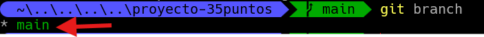
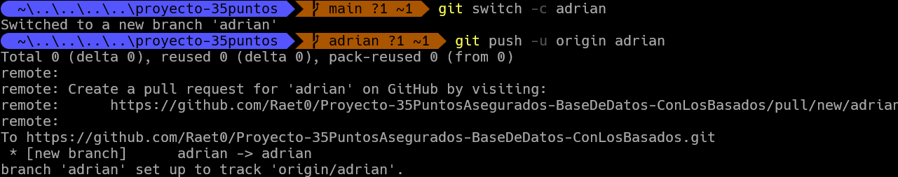
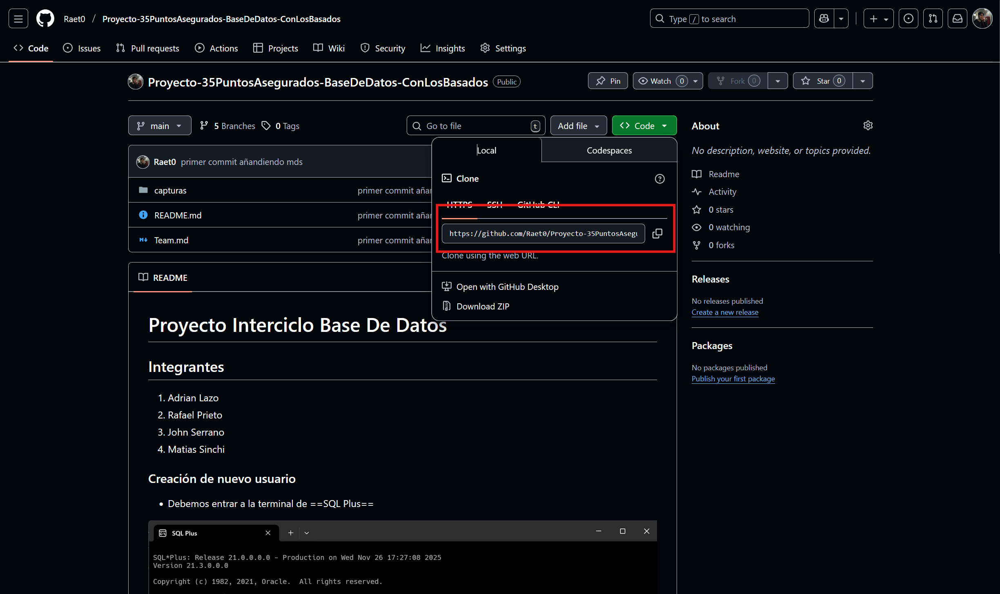
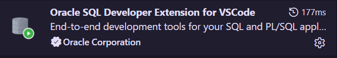

# Dudas sobre manejo de git y cambios que cada integrante haga

## Como crear una rama en git, verificación rama y como cambiar de rama

1. # Como crear una rama nueva en git
Les voy a dar el paso a paso de como crear una rama en git, de igual manera yo creare las ramas respectivas para cada uno de ustedes.
Primero podemos hacer es verificar en la rama que nos entramos, para ello corremos el siguente comando en terminal.
```bash
git branch
```
Esto nos reflejara en la rama que nos encontramos:



Lo que vemos señalados en la captura es la rama principal a las que tendremos que hacer pull osea a esta rama no se tiene que subir cambios ya que sera la rama prinicipal, se mantendran los cambios que se van a mostrar al profesor lo que tenemos que hacer es subir cada uno de su cambios a sus propias ramas, entonces vamos a explicar eso como crear una rama.
El comando para crear la rama es el siguente:
```bash
git switch -c nombre(delintegrante)
```
Para confirmar la rama en el github:
```bash
git push -u origin nombre(delintegrante)
```
Aqui tenemos una imagen de como se crea la rama:


2. # Verificar Rama en la que estamos 
Para hacer esto es muy facil solo debemos ejecutar:
```bash
git branch o git branch -a
```
Esto nos nostrara en un color diferente en la rama que nos encontramos y la rama que no estamos aparecera de color blanco, mientras que la rama donde nos encontramos estara pintada de un color.
3. # Cambiar de rama

Para cambiar de rama solo debemos saber el nombre de nuestras rama y hacer el siguente comando:
```bash
git checkout (nombredelarama-a-cambiar)
```

## Como vamos a trabajar para subir los cambios de los repositorios

Primero que debemos hacer es ingresar al repositorio y ir a la siguente parte:

Debemos abrir ese panel que se ve en la imagen y debemos copiar el link que esta encerrado en el cuadro rojo y de ahi clonar el repo en algun lugar donde no lo borraremos.



Lo hacemos por terminal, con el comando cd nos ponemos en el lugar donde vamos a clonar el repo:
```bash
git clone https://github.com/Raet0/Proyecto-35PuntosAsegurados-BaseDeDatos-ConLosBasados.git
``` 
Y bueno si no queremos clonar podemos descargar el repo, ahi donde esta el cuadro rojo dice download o descargar y pues lo descargar y lo descomprimer y abres la carpeta con vscode.

# EXTENCIÓN

Necesitamos tener instala una extensión en vscode para poder trabajar desde vscode.



# Manera de trabajo en el git

Cada quien apenas clone o descargue el repo tendra que entrar en vscode y cambiar de rama a la propia ya que todos tendras los datos prinicipales del git principal.

