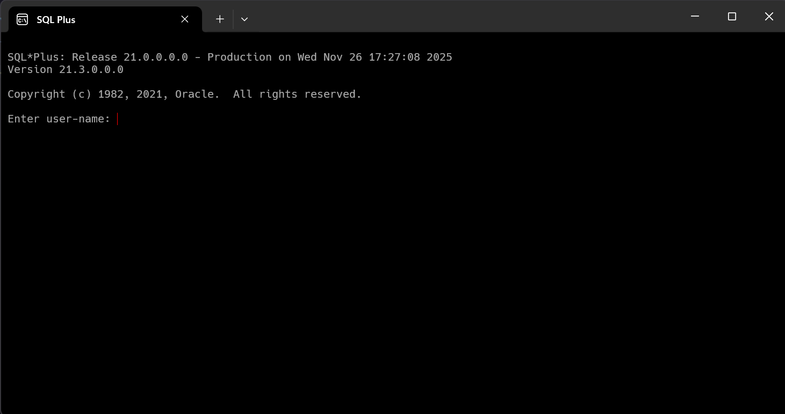
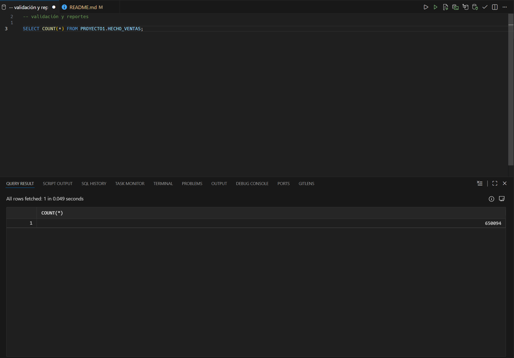
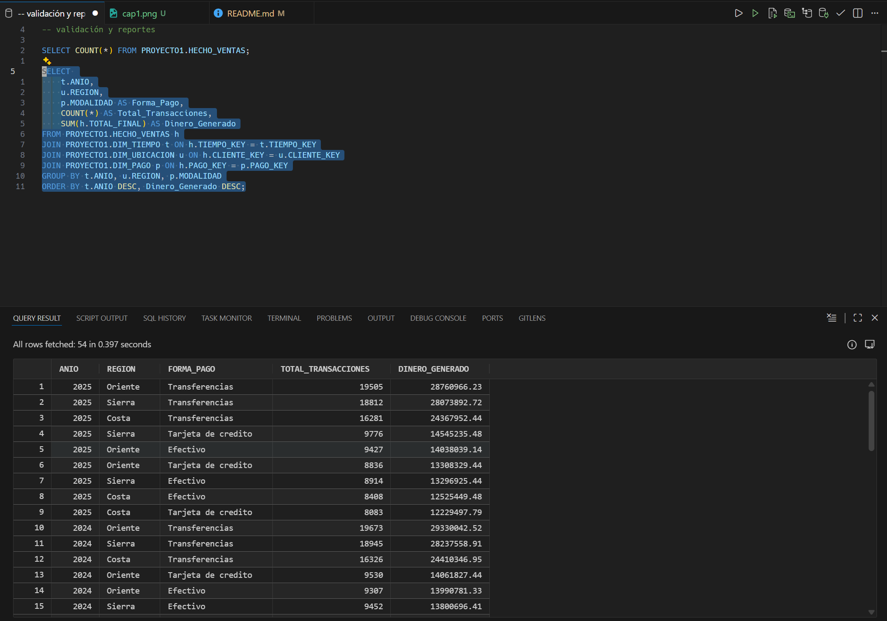
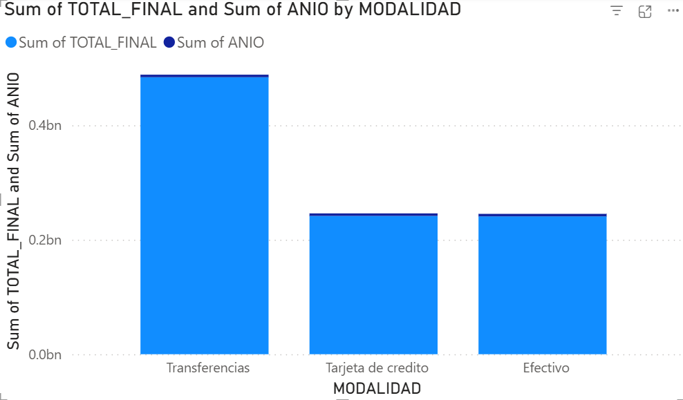
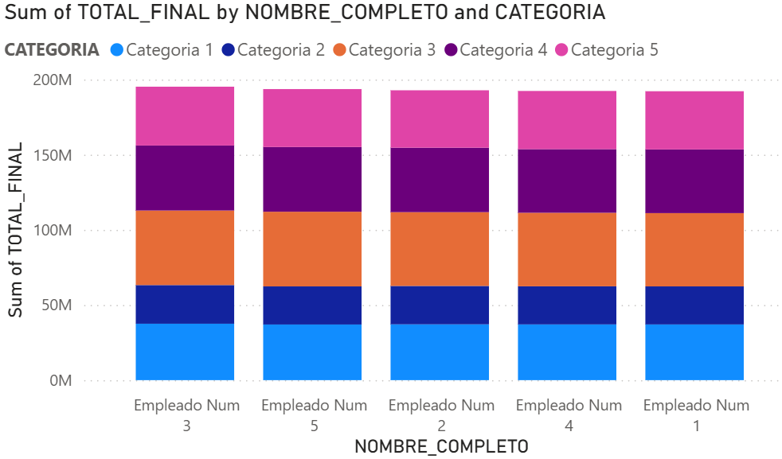
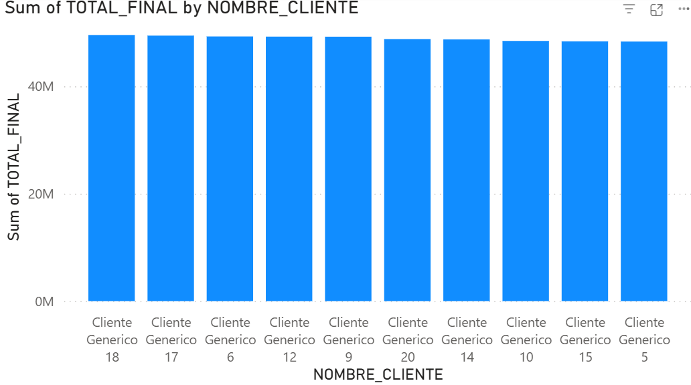
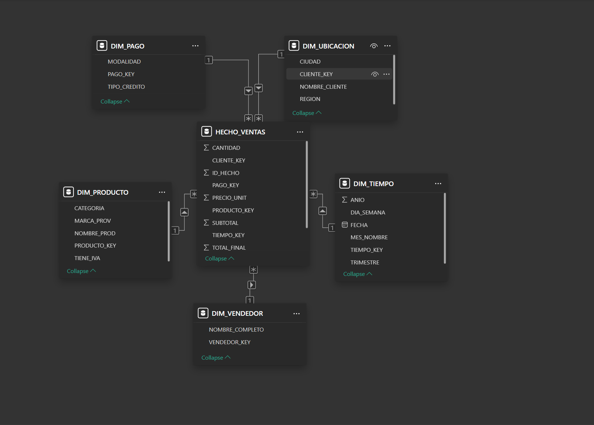

# Proyecto Interciclo Base De Datos

## Integrantes
1.  Adrian Lazo
2.  Rafael Prieto
3. John Serrano
4. Matias Sinchi

### Creación de nuevo usuario

- Debemos entrar a la terminal de ==SQL Plus==



```bash
/as sysdba
```
```bash
ALTER SESSION SET "_ORACLE_SCRIPT"= TRUE;
```
- Ingresamos el comando para poder crear el usuario
```bash
CREATE USER proyecto1 IDENTIFIED BY "123"
```
- El siguente comando son los valores que le daremos al usuario
```bash
DEFAULT TABLESPACE "USERS"
TEMPORARY TABLESPACE "TEMP";
```
- le damos un espacio ilimitado por si las dudas
```bash
ALTER USER proyecto1 QUOTA UNLIMITED ON USERS;
```
- creamos una session para el usuario
```bash
GRANT CREATE SESSION TO proyecto1;
```
- y le damos los ultimos atributos al proyecto
```bash
GRANT "RESOURCE" TO proyecto1; 
ALTER USER proyecto1 DEFAULT ROLE "RESOURCE";
```

# Creación de la base de datos

## Creación de las tablas principales

```bash
-- ==========================
-- 1. TABLA CATEGORIAS
-- ==========================
CREATE TABLE PROYECTO1.CATEGORIAS (
    CATEGORIAID   NUMBER(10,0)  NOT NULL,
    NOMBRECAT     CHAR(50 BYTE) NOT NULL,
    CONSTRAINT PK_CATEGORIAS PRIMARY KEY (CATEGORIAID)
);

-- ==========================
-- 2. TABLA PROVEEDORES
-- ==========================
CREATE TABLE PROYECTO1.PROVEEDORES (
    PROVEEDORID   NUMBER(10,0)  NOT NULL,
    NOMBREPROV    CHAR(50 BYTE) NOT NULL,
    CONTACTO      CHAR(50 BYTE),
    CELUPROV      CHAR(12 BYTE),
    FIJOPROV      CHAR(12 BYTE),
    CONSTRAINT PK_PROVEEDORES PRIMARY KEY (PROVEEDORID)
);

-- ==========================
-- 3. TABLA PRODUCTOS
-- ==========================
CREATE TABLE PROYECTO1.PRODUCTOS (
    PRODUCTOID   NUMBER(10,0)  NOT NULL,
    CATEGORIAID  NUMBER(10,0)  NOT NULL,
    PROVEEDORID  NUMBER(10,0)  NOT NULL,
    DESCRIPCION  CHAR(50 BYTE),
    PRECIOUNIT   NUMBER(10,2),
    EXISTENCIA   NUMBER(10,0),
    CONSTRAINT PK_PRODUCTOS PRIMARY KEY (PRODUCTOID),
    CONSTRAINT FK_PRODUCTO_CATE_PROD_CATEGORI 
        FOREIGN KEY (CATEGORIAID) 
        REFERENCES PROYECTO1.CATEGORIAS (CATEGORIAID),
    CONSTRAINT FK_PRODUCTO_PROV_PROD_PROVEEDOR 
        FOREIGN KEY (PROVEEDORID) 
        REFERENCES PROYECTO1.PROVEEDORES (PROVEEDORID)
);

-- ==========================
-- 4. TABLA EMPLEADOS
-- ==========================
CREATE TABLE PROYECTO1.EMPLEADOS (
    EMPLEADOID   NUMBER(10,0)  NOT NULL,
    NOMBRE       CHAR(30 BYTE) NOT NULL,
    APELLIDO     CHAR(30 BYTE) NOT NULL,
    FECHA_NAC    DATE,
    REPORTA_A    NUMBER(10,0),
    EXTENSION    NUMBER(10,0),
    CONSTRAINT PK_EMPLEADOS PRIMARY KEY (EMPLEADOID),
    CONSTRAINT FK_EMPLEADO_REPORTA 
        FOREIGN KEY (REPORTA_A)
        REFERENCES PROYECTO1.EMPLEADOS (EMPLEADOID)
);

-- ==========================
-- 5. TABLA CLIENTES
-- ==========================
CREATE TABLE PROYECTO1.CLIENTES (
    CLIENTEID        NUMBER(10,0)  NOT NULL,
    CEDULA_RUC       CHAR(10 BYTE) NOT NULL,
    NOMBRECLI        CHAR(30 BYTE) NOT NULL,
    NOMBRECONTACTO   CHAR(50 BYTE),
    DIRECCIONCLI     CHAR(50 BYTE),
    FAX              CHAR(12 BYTE),
    EMAIL            CHAR(50 BYTE),
    CELULAR          CHAR(12 BYTE),
    FIJO             CHAR(12 BYTE),
    CONSTRAINT PK_CLIENTES PRIMARY KEY (CLIENTEID)
);

-- ==========================
-- 6. TABLA ORDENES
-- ==========================
CREATE TABLE PROYECTO1.ORDENES (
    ORDENID     NUMBER(10,0) NOT NULL,
    EMPLEADOID  NUMBER(10,0) NOT NULL,
    CLIENTEID   NUMBER(10,0) NOT NULL,
    FECHAORDEN  DATE,
    DESCUENTO   NUMBER(5,2),
    CONSTRAINT PK_ORDENES PRIMARY KEY (ORDENID),
    CONSTRAINT FK_ORDENES_EMPLE_ORD_EMPLEADO 
        FOREIGN KEY (EMPLEADOID)
        REFERENCES PROYECTO1.EMPLEADOS (EMPLEADOID),
    CONSTRAINT FK_ORDENES_CLIEN_ORD_CLIENTES 
        FOREIGN KEY (CLIENTEID)
        REFERENCES PROYECTO1.CLIENTES (CLIENTEID)
);

-- ==========================
-- 7. TABLA DETALLE_ORDENES
-- ==========================
CREATE TABLE PROYECTO1.DETALLE_ORDENES (
    ORDENID     NUMBER(10,0) NOT NULL,
    DETALLEID   NUMBER(10,0) NOT NULL,
    PRODUCTOID  NUMBER(10,0) NOT NULL,
    CANTIDAD    NUMBER(10,0) NOT NULL,
    CONSTRAINT PK_DETALLE_ORDENES 
        PRIMARY KEY (ORDENID, DETALLEID),
    CONSTRAINT FK_DETALLE_ORDEN_DET_ORDENES 
        FOREIGN KEY (ORDENID)
        REFERENCES PROYECTO1.ORDENES (ORDENID),
    CONSTRAINT FK_DETALLE_PROD_DETA_PRODUCTO 
        FOREIGN KEY (PRODUCTOID)
        REFERENCES PROYECTO1.PRODUCTOS (PRODUCTOID)
);

```

# Ingreso de datos

Ahora mostrare un cuadro donde estaran los datos ingresados y todo listo para comenzar con el diseño de OLAP
```bash
-- modificación(agregar columna de iva productos)

ALTER TABLE PRODUCTOS
ADD PorcentajeIVA NUMBER(4,2) DEFAULT 0.15 NOT NULL;

-- 2. creando la tabal modalidad de pago
-- nuestro documento exige registrar efectivo, transferencias y tarjetas con cuotas.

CREATE TABLE ModalidadPago(
  ID_Modalidad NUMBER GENERATED BY DEFAULT AS IDENTITY PRIMARY KEY,
  Nombre VARCHAR2(50),
  Cuotas NUMBER DEFAULT 0
);

-- vamos a insertar datos fijos dentro de la tabla
INSERT INTO MODALIDADPAGO (Nombre,Cuotas) VALUES ('Efectivo',0);
INSERT INTO MODALIDADPAGO (Nombre,Cuotas) VALUES ('Transferencias',0);
INSERT INTO MODALIDADPAGO (Nombre,Cuotas) VALUES ('Tarjeta de credito',3);
INSERT INTO MODALIDADPAGO (Nombre,Cuotas) VALUES ('Tarjeta de credito',12);

COMMIT;

-- conectar pedidos con modalidad 

ALTER TABLE ordenes
ADD ID_Modalidad NUMBER;

ALTER TABLE ordenes 
ADD CONSTRAINT FK_Pedidos_Modalidad 
FOREIGN KEY (ID_Modalidad) REFERENCES ModalidadPago(ID_Modalidad);

select * from ordenes, DETALLE_ORDENES;

-- para ingresar los 1000 datos, debemos insertar quien compra y a quien compra

BEGIN
    -- 1. Insertar 5 Categorias
    FOR i IN 1..5 LOOP
        INSERT INTO PROYECTO1.CATEGORIAS (CATEGORIAID, NOMBRECAT) 
        VALUES (i, 'Categoria ' || i);
    END LOOP;

    -- 2. Insertar 10 Proveedores
    FOR i IN 1..10 LOOP
        INSERT INTO PROYECTO1.PROVEEDORES (PROVEEDORID, NOMBREPROV, CONTACTO, CELUPROV) 
        VALUES (i, 'Proveedor ' || i, 'Contacto ' || i, '099999999');
    END LOOP;

    -- 3. Insertar 5 Empleados
    FOR i IN 1..5 LOOP
        INSERT INTO PROYECTO1.EMPLEADOS (EMPLEADOID, NOMBRE, APELLIDO, FECHA_NAC) 
        VALUES (i, 'Empleado', 'Num ' || i, SYSDATE - 10000);
    END LOOP;

    -- 4. Insertar 20 Clientes (CORREGIDO)
    -- Usamos LPAD para rellenar con ceros a la izquierda hasta llegar a 10 dígitos exactos
    -- Ejemplo: el ID 1 se convierte en '0000000001', el ID 20 en '0000000020'
    FOR i IN 1..20 LOOP
        INSERT INTO PROYECTO1.CLIENTES (CLIENTEID, CEDULA_RUC, NOMBRECLI, DIRECCIONCLI) 
        VALUES (i, LPAD(i, 10, '0'), 'Cliente Generico ' || i, 'Direccion ' || i);
    END LOOP;

    -- 5. Insertar 200 Productos
    FOR i IN 1..200 LOOP
        INSERT INTO PROYECTO1.PRODUCTOS (PRODUCTOID, CATEGORIAID, PROVEEDORID, DESCRIPCION, PRECIOUNIT, EXISTENCIA, PorcentajeIVA) 
        VALUES (
            i, 
            TRUNC(DBMS_RANDOM.VALUE(1, 6)),   
            TRUNC(DBMS_RANDOM.VALUE(1, 11)),  
            'Producto ' || i, 
            ROUND(DBMS_RANDOM.VALUE(10, 100), 2), 
            1000,
            CASE WHEN i <= 100 THEN 0.15 ELSE 0.00 END 
        );
    END LOOP;

    COMMIT;
    DBMS_OUTPUT.PUT_LINE('Datos Maestros creados exitosamente.');
END;
/

-- insertando los 100,000 pedidos

DECLARE
    -- Configuración
    v_TotalOrdenes   NUMBER := 100000;
    
    -- Variables para IDs aleatorios
    v_EmpleadoID     NUMBER;
    v_ClienteID      NUMBER;
    v_ModalidadID    NUMBER;
    v_FechaOrden     DATE;
    
    -- Variables para el detalle
    v_NumProductos   NUMBER; -- Cuántos items tendrá la orden
    v_ProductoID     NUMBER;
    v_Cantidad       NUMBER;
    
    -- Fecha inicio para cálculo (01/01/2020)
    v_FechaInicio    DATE := TO_DATE('01/01/2020','DD/MM/YYYY');
    
BEGIN
    FOR i IN 1..v_TotalOrdenes LOOP
        
        -- A. Generar Datos de Cabecera (ORDENES)
        -- Seleccionamos IDs aleatorios basados en los rangos que creamos en el Paso 1
        v_EmpleadoID  := TRUNC(DBMS_RANDOM.VALUE(1, 6));  -- IDs 1 al 5
        v_ClienteID   := TRUNC(DBMS_RANDOM.VALUE(1, 21)); -- IDs 1 al 20
        
        -- Tu tabla ModalidadPago tiene 4 registros insertados manualmente.
        -- Asumimos que los IDs generados fueron 1, 2, 3, 4 (o buscamos al azar).
        -- Nota: Si usaste Identity, los IDs deberían ser secuenciales. Usaremos 1-4.
        v_ModalidadID := TRUNC(DBMS_RANDOM.VALUE(1, 5)); 
        
        -- Fecha aleatoria: 01/01/2020 + (0 a 2190 días) -> Cubre hasta finales de 2025
        v_FechaOrden  := v_FechaInicio + TRUNC(DBMS_RANDOM.VALUE(0, 2191));
        
        -- B. Insertar la Orden
        -- Usamos 'i' como ORDENID ya que es único en este bucle
        INSERT INTO ORDENES (ORDENID, EMPLEADOID, CLIENTEID, FECHAORDEN, DESCUENTO, ID_Modalidad)
        VALUES (i, v_EmpleadoID, v_ClienteID, v_FechaOrden, 0, v_ModalidadID);
        
        -- C. Generar el Detalle (DETALLE_ORDENES)
        -- Requisito: "Cada pedido debe tener de 3 a 10 productos"
        v_NumProductos := TRUNC(DBMS_RANDOM.VALUE(3, 11)); 
        
        FOR j IN 1..v_NumProductos LOOP
             -- Producto aleatorio (IDs 1 al 200)
             v_ProductoID := TRUNC(DBMS_RANDOM.VALUE(1, 201));
             
             -- Cantidad aleatoria (1 a 50)
             v_Cantidad := TRUNC(DBMS_RANDOM.VALUE(1, 51));
             
             INSERT INTO DETALLE_ORDENES (ORDENID, DETALLEID, PRODUCTOID, CANTIDAD)
             VALUES (i, j, v_ProductoID, v_Cantidad);
        END LOOP;
        
        -- D. Commit parcial para no saturar la memoria RAM
        -- Guardamos cambios cada 5,000 órdenes
        IF MOD(i, 5000) = 0 THEN
            COMMIT;
        END IF;
        
    END LOOP;
    
    -- Commit final para asegurar los últimos registros
    COMMIT;
END;
/


-- vamos a comprobar si todo salio bien(opcional)

-- Verificar cantidad de órdenes (Debe dar 100,000)
SELECT COUNT(*) AS Total_Ordenes FROM ORDENES;

-- Verificar detalle masivo (Debe dar aprox 650,000 registros)
SELECT COUNT(*) AS Total_Detalles FROM DETALLE_ORDENES;

-- Verificar que las fechas estén bien distribuidas (debe salir 2020, 2021... 2025)
SELECT EXTRACT(YEAR FROM FECHAORDEN) AS Anio, COUNT(*) 
FROM ORDENES 
GROUP BY EXTRACT(YEAR FROM FECHAORDEN)
ORDER BY Anio;


```

# Creación de la DataWareHouse y introducción de los datos

Para esto tenemos las siguentes líneas de codigo que cada una tiene su explicación en forma de comentario

```bash
-- construcción de la modelo estrella

-- 1. DIMENSIÓN TIEMPO
-- Necesaria para analizar por Año, Mes, Trimestre (Requisito del PDF)
CREATE TABLE PROYECTO1.DIM_TIEMPO (
    TIEMPO_KEY    NUMBER PRIMARY KEY, -- Usaremos formato YYYYMMDD (ej: 20250101)
    FECHA         DATE,
    ANIO          NUMBER(4),
    TRIMESTRE     VARCHAR2(20),
    MES_NOMBRE    VARCHAR2(20),
    DIA_SEMANA    VARCHAR2(20)
);

-- 2. DIMENSIÓN PRODUCTO
-- Desnormalizamos Producto + Categoría en una sola tabla para consultas rápidas
CREATE TABLE PROYECTO1.DIM_PRODUCTO (
    PRODUCTO_KEY  NUMBER PRIMARY KEY, -- Será el mismo ProductID original
    NOMBRE_PROD   VARCHAR2(100),
    CATEGORIA     VARCHAR2(50),
    MARCA_PROV    VARCHAR2(50),      -- Nombre del proveedor
    TIENE_IVA     VARCHAR2(2)        -- 'SI' o 'NO' para facilitar filtros
);

-- 3. DIMENSIÓN UBICACIÓN (CLIENTE)
-- El PDF pide análisis por "Región". Como tus clientes no tienen región,
-- la "inventaremos" o asignaremos en el proceso ETL para cumplir el requisito.
CREATE TABLE PROYECTO1.DIM_UBICACION (
    CLIENTE_KEY   NUMBER PRIMARY KEY, -- Será el mismo ClienteID
    NOMBRE_CLIENTE VARCHAR2(100),
    REGION        VARCHAR2(50),       -- Costa, Sierra, Oriente (lo llenaremos en ETL)
    CIUDAD        VARCHAR2(50)
);

-- 4. DIMENSIÓN MODALIDAD PAGO
-- Para analizar "Forma de pago preferida"
CREATE TABLE PROYECTO1.DIM_PAGO (
    PAGO_KEY      NUMBER PRIMARY KEY,
    MODALIDAD     VARCHAR2(50),
    TIPO_CREDITO  VARCHAR2(20)       -- 'Corriente' o 'Diferido'
);

-- 5. DIMENSIÓN VENDEDOR
-- Para "El mejor vendedor por categoría..."
CREATE TABLE PROYECTO1.DIM_VENDEDOR (
    VENDEDOR_KEY  NUMBER PRIMARY KEY,
    NOMBRE_COMPLETO VARCHAR2(100)
);

CREATE TABLE PROYECTO1.HECHO_VENTAS (
    ID_HECHO      NUMBER GENERATED BY DEFAULT AS IDENTITY PRIMARY KEY,
    
    -- Llaves Foráneas a las Dimensiones
    TIEMPO_KEY    NUMBER,
    PRODUCTO_KEY  NUMBER,
    CLIENTE_KEY   NUMBER,
    PAGO_KEY      NUMBER,
    VENDEDOR_KEY  NUMBER,
    
    -- Métricas (Lo que se puede sumar/contar)
    CANTIDAD      NUMBER,
    PRECIO_UNIT   NUMBER(10,2),
    SUBTOTAL      NUMBER(12,2),
    VALOR_IVA     NUMBER(12,2),
    TOTAL_FINAL   NUMBER(12,2),
    
    -- Constraints para asegurar la estrella
    CONSTRAINT FK_HECHO_TIEMPO FOREIGN KEY (TIEMPO_KEY) REFERENCES PROYECTO1.DIM_TIEMPO(TIEMPO_KEY),
    CONSTRAINT FK_HECHO_PROD   FOREIGN KEY (PRODUCTO_KEY) REFERENCES PROYECTO1.DIM_PRODUCTO(PRODUCTO_KEY),
    CONSTRAINT FK_HECHO_CLI    FOREIGN KEY (CLIENTE_KEY) REFERENCES PROYECTO1.DIM_UBICACION(CLIENTE_KEY),
    CONSTRAINT FK_HECHO_PAGO   FOREIGN KEY (PAGO_KEY) REFERENCES PROYECTO1.DIM_PAGO(PAGO_KEY),
    CONSTRAINT FK_HECHO_VEND   FOREIGN KEY (VENDEDOR_KEY) REFERENCES PROYECTO1.DIM_VENDEDOR(VENDEDOR_KEY)
);

-- nuestros datos estan en las tablas normales no estan en el datawarehouse que hemos creado entonces vamos a seguir con los siguentes pasos.

-- 1. Llenar Dimensión VENDEDOR
INSERT INTO PROYECTO1.DIM_VENDEDOR (VENDEDOR_KEY, NOMBRE_COMPLETO)
SELECT EMPLEADOID, NOMBRE || ' ' || APELLIDO 
FROM PROYECTO1.EMPLEADOS;

-- 2. Llenar Dimensión PRODUCTO (CORREGIDO)
INSERT INTO PROYECTO1.DIM_PRODUCTO (PRODUCTO_KEY, NOMBRE_PROD, CATEGORIA, MARCA_PROV, TIENE_IVA)
SELECT 
    p.PRODUCTOID, 
    p.DESCRIPCION, 
    c.NOMBRECAT, 
    pr.NOMBREPROV,
    -- Aquí estaba el error: cambiamos PORCENTAJE_IVA por PORCENTAJEIVA
    CASE WHEN p.PORCENTAJEIVA > 0 THEN 'SI' ELSE 'NO' END 
FROM PROYECTO1.PRODUCTOS p
JOIN PROYECTO1.CATEGORIAS c ON p.CATEGORIAID = c.CATEGORIAID
JOIN PROYECTO1.PROVEEDORES pr ON p.PROVEEDORID = pr.PROVEEDORID;

-- 3. Llenar Dimensión PAGO
INSERT INTO PROYECTO1.DIM_PAGO (PAGO_KEY, MODALIDAD, TIPO_CREDITO)
SELECT 
    ID_MODALIDAD, 
    NOMBRE, 
    CASE WHEN CUOTAS > 0 THEN 'Diferido' ELSE 'Corriente' END
FROM PROYECTO1.MODALIDADPAGO;

-- 4. Llenar Dimensión UBICACIÓN (CLIENTE)
-- El manual pide "Región". Como no la tenemos, usamos una función HASH para
-- asignar aleatoriamente 'Costa', 'Sierra' o 'Oriente' a cada cliente y que sea consistente.
INSERT INTO PROYECTO1.DIM_UBICACION (CLIENTE_KEY, NOMBRE_CLIENTE, CIUDAD, REGION)
SELECT 
    CLIENTEID, 
    NOMBRECLI, 
    'Ciudad Generica', -- Dato quemado
    CASE MOD(CLIENTEID, 3) 
        WHEN 0 THEN 'Costa' 
        WHEN 1 THEN 'Sierra' 
        ELSE 'Oriente' 
    END -- Transformación para cumplir requisito de Región
FROM PROYECTO1.CLIENTES;

commit;

-- vamos a llenar la dimensión timepo(especial)

DECLARE
    v_FechaInicio DATE := TO_DATE('01/01/2020','DD/MM/YYYY');
    v_FechaFin    DATE := TO_DATE('31/12/2025','DD/MM/YYYY');
    v_FechaActual DATE;
    v_Key         NUMBER;
BEGIN
    v_FechaActual := v_FechaInicio;
    
    WHILE v_FechaActual <= v_FechaFin LOOP
        -- Generar Key formato YYYYMMDD (Ej: 20240115)
        v_Key := TO_NUMBER(TO_CHAR(v_FechaActual, 'YYYYMMDD'));
        
        INSERT INTO PROYECTO1.DIM_TIEMPO (TIEMPO_KEY, FECHA, ANIO, TRIMESTRE, MES_NOMBRE, DIA_SEMANA)
        VALUES (
            v_Key,
            v_FechaActual,
            EXTRACT(YEAR FROM v_FechaActual),
            'T' || TO_CHAR(v_FechaActual, 'Q'), -- Trimestre (T1, T2...)
            TO_CHAR(v_FechaActual, 'MONTH', 'NLS_DATE_LANGUAGE=SPANISH'), -- Mes en español
            TO_CHAR(v_FechaActual, 'DAY', 'NLS_DATE_LANGUAGE=SPANISH')    -- Día en español
        );
        
        v_FechaActual := v_FechaActual + 1; -- Avanzar un día
    END LOOP;
    
    COMMIT;
END;
/

-- vamos a llenar la carga hechos esta es la tabla masiva
-- Este script toma tus 100,000 órdenes y su detalle, calcula el dinero real (Precio * Cantidad) y el IVA, y lo guarda en el formato OLAP.

INSERT INTO PROYECTO1.HECHO_VENTAS (
    TIEMPO_KEY, PRODUCTO_KEY, CLIENTE_KEY, PAGO_KEY, VENDEDOR_KEY,
    CANTIDAD, PRECIO_UNIT, SUBTOTAL, VALOR_IVA, TOTAL_FINAL
)
SELECT 
    -- 1. Construir el Key de Tiempo basado en la fecha de la orden
    TO_NUMBER(TO_CHAR(o.FECHAORDEN, 'YYYYMMDD')) AS TIEMPO_KEY,
    
    -- 2. Llaves directas
    d.PRODUCTOID AS PRODUCTO_KEY,
    o.CLIENTEID  AS CLIENTE_KEY,
    o.ID_Modalidad AS PAGO_KEY,
    o.EMPLEADOID AS VENDEDOR_KEY,
    
    -- 3. Métricas Calculadas
    d.CANTIDAD,
    p.PRECIOUNIT,
    (d.CANTIDAD * p.PRECIOUNIT) AS SUBTOTAL, -- Cantidad * Precio
    (d.CANTIDAD * p.PRECIOUNIT * p.PORCENTAJEIVA) AS VALOR_IVA, -- Calculo de IVA real
    ((d.CANTIDAD * p.PRECIOUNIT) * (1 + p.PORCENTAJEIVA)) AS TOTAL_FINAL
    
FROM PROYECTO1.ORDENES o
JOIN PROYECTO1.DETALLE_ORDENES d ON o.ORDENID = d.ORDENID
JOIN PROYECTO1.PRODUCTOS p ON d.PRODUCTOID = p.PRODUCTOID;

COMMIT;
```

# Verificación
Para esto tenemos unas consultas de los datos como el cliente mas fiel o el producto mas vendido.
```bash
-- construcción de la modelo estrella

-- 1. DIMENSIÓN TIEMPO
-- Necesaria para analizar por Año, Mes, Trimestre (Requisito del PDF)
CREATE TABLE PROYECTO1.DIM_TIEMPO (
    TIEMPO_KEY    NUMBER PRIMARY KEY, -- Usaremos formato YYYYMMDD (ej: 20250101)
    FECHA         DATE,
    ANIO          NUMBER(4),
    TRIMESTRE     VARCHAR2(20),
    MES_NOMBRE    VARCHAR2(20),
    DIA_SEMANA    VARCHAR2(20)
);

-- 2. DIMENSIÓN PRODUCTO
-- Desnormalizamos Producto + Categoría en una sola tabla para consultas rápidas
CREATE TABLE PROYECTO1.DIM_PRODUCTO (
    PRODUCTO_KEY  NUMBER PRIMARY KEY, -- Será el mismo ProductID original
    NOMBRE_PROD   VARCHAR2(100),
    CATEGORIA     VARCHAR2(50),
    MARCA_PROV    VARCHAR2(50),      -- Nombre del proveedor
    TIENE_IVA     VARCHAR2(2)        -- 'SI' o 'NO' para facilitar filtros
);

-- 3. DIMENSIÓN UBICACIÓN (CLIENTE)
-- El PDF pide análisis por "Región". Como tus clientes no tienen región,
-- la "inventaremos" o asignaremos en el proceso ETL para cumplir el requisito.
CREATE TABLE PROYECTO1.DIM_UBICACION (
    CLIENTE_KEY   NUMBER PRIMARY KEY, -- Será el mismo ClienteID
    NOMBRE_CLIENTE VARCHAR2(100),
    REGION        VARCHAR2(50),       -- Costa, Sierra, Oriente (lo llenaremos en ETL)
    CIUDAD        VARCHAR2(50)
);

-- 4. DIMENSIÓN MODALIDAD PAGO
-- Para analizar "Forma de pago preferida"
CREATE TABLE PROYECTO1.DIM_PAGO (
    PAGO_KEY      NUMBER PRIMARY KEY,
    MODALIDAD     VARCHAR2(50),
    TIPO_CREDITO  VARCHAR2(20)       -- 'Corriente' o 'Diferido'
);

-- 5. DIMENSIÓN VENDEDOR
-- Para "El mejor vendedor por categoría..."
CREATE TABLE PROYECTO1.DIM_VENDEDOR (
    VENDEDOR_KEY  NUMBER PRIMARY KEY,
    NOMBRE_COMPLETO VARCHAR2(100)
);

CREATE TABLE PROYECTO1.HECHO_VENTAS (
    ID_HECHO      NUMBER GENERATED BY DEFAULT AS IDENTITY PRIMARY KEY,
    
    -- Llaves Foráneas a las Dimensiones
    TIEMPO_KEY    NUMBER,
    PRODUCTO_KEY  NUMBER,
    CLIENTE_KEY   NUMBER,
    PAGO_KEY      NUMBER,
    VENDEDOR_KEY  NUMBER,
    
    -- Métricas (Lo que se puede sumar/contar)
    CANTIDAD      NUMBER,
    PRECIO_UNIT   NUMBER(10,2),
    SUBTOTAL      NUMBER(12,2),
    VALOR_IVA     NUMBER(12,2),
    TOTAL_FINAL   NUMBER(12,2),
    
    -- Constraints para asegurar la estrella
    CONSTRAINT FK_HECHO_TIEMPO FOREIGN KEY (TIEMPO_KEY) REFERENCES PROYECTO1.DIM_TIEMPO(TIEMPO_KEY),
    CONSTRAINT FK_HECHO_PROD   FOREIGN KEY (PRODUCTO_KEY) REFERENCES PROYECTO1.DIM_PRODUCTO(PRODUCTO_KEY),
    CONSTRAINT FK_HECHO_CLI    FOREIGN KEY (CLIENTE_KEY) REFERENCES PROYECTO1.DIM_UBICACION(CLIENTE_KEY),
    CONSTRAINT FK_HECHO_PAGO   FOREIGN KEY (PAGO_KEY) REFERENCES PROYECTO1.DIM_PAGO(PAGO_KEY),
    CONSTRAINT FK_HECHO_VEND   FOREIGN KEY (VENDEDOR_KEY) REFERENCES PROYECTO1.DIM_VENDEDOR(VENDEDOR_KEY)
);

-- nuestros datos estan en las tablas normales no estan en el datawarehouse que hemos creado entonces vamos a seguir con los siguentes pasos.

-- 1. Llenar Dimensión VENDEDOR
INSERT INTO PROYECTO1.DIM_VENDEDOR (VENDEDOR_KEY, NOMBRE_COMPLETO)
SELECT EMPLEADOID, NOMBRE || ' ' || APELLIDO 
FROM PROYECTO1.EMPLEADOS;

-- 2. Llenar Dimensión PRODUCTO (CORREGIDO)
INSERT INTO PROYECTO1.DIM_PRODUCTO (PRODUCTO_KEY, NOMBRE_PROD, CATEGORIA, MARCA_PROV, TIENE_IVA)
SELECT 
    p.PRODUCTOID, 
    p.DESCRIPCION, 
    c.NOMBRECAT, 
    pr.NOMBREPROV,
    -- Aquí estaba el error: cambiamos PORCENTAJE_IVA por PORCENTAJEIVA
    CASE WHEN p.PORCENTAJEIVA > 0 THEN 'SI' ELSE 'NO' END 
FROM PROYECTO1.PRODUCTOS p
JOIN PROYECTO1.CATEGORIAS c ON p.CATEGORIAID = c.CATEGORIAID
JOIN PROYECTO1.PROVEEDORES pr ON p.PROVEEDORID = pr.PROVEEDORID;

-- 3. Llenar Dimensión PAGO
INSERT INTO PROYECTO1.DIM_PAGO (PAGO_KEY, MODALIDAD, TIPO_CREDITO)
SELECT 
    ID_MODALIDAD, 
    NOMBRE, 
    CASE WHEN CUOTAS > 0 THEN 'Diferido' ELSE 'Corriente' END
FROM PROYECTO1.MODALIDADPAGO;

-- 4. Llenar Dimensión UBICACIÓN (CLIENTE)
-- El manual pide "Región". Como no la tenemos, usamos una función HASH para
-- asignar aleatoriamente 'Costa', 'Sierra' o 'Oriente' a cada cliente y que sea consistente.
INSERT INTO PROYECTO1.DIM_UBICACION (CLIENTE_KEY, NOMBRE_CLIENTE, CIUDAD, REGION)
SELECT 
    CLIENTEID, 
    NOMBRECLI, 
    'Ciudad Generica', -- Dato quemado
    CASE MOD(CLIENTEID, 3) 
        WHEN 0 THEN 'Costa' 
        WHEN 1 THEN 'Sierra' 
        ELSE 'Oriente' 
    END -- Transformación para cumplir requisito de Región
FROM PROYECTO1.CLIENTES;

commit;

-- vamos a llenar la dimensión timepo(especial)

DECLARE
    v_FechaInicio DATE := TO_DATE('01/01/2020','DD/MM/YYYY');
    v_FechaFin    DATE := TO_DATE('31/12/2025','DD/MM/YYYY');
    v_FechaActual DATE;
    v_Key         NUMBER;
BEGIN
    v_FechaActual := v_FechaInicio;
    
    WHILE v_FechaActual <= v_FechaFin LOOP
        -- Generar Key formato YYYYMMDD (Ej: 20240115)
        v_Key := TO_NUMBER(TO_CHAR(v_FechaActual, 'YYYYMMDD'));
        
        INSERT INTO PROYECTO1.DIM_TIEMPO (TIEMPO_KEY, FECHA, ANIO, TRIMESTRE, MES_NOMBRE, DIA_SEMANA)
        VALUES (
            v_Key,
            v_FechaActual,
            EXTRACT(YEAR FROM v_FechaActual),
            'T' || TO_CHAR(v_FechaActual, 'Q'), -- Trimestre (T1, T2...)
            TO_CHAR(v_FechaActual, 'MONTH', 'NLS_DATE_LANGUAGE=SPANISH'), -- Mes en español
            TO_CHAR(v_FechaActual, 'DAY', 'NLS_DATE_LANGUAGE=SPANISH')    -- Día en español
        );
        
        v_FechaActual := v_FechaActual + 1; -- Avanzar un día
    END LOOP;
    
    COMMIT;
END;
/

-- vamos a llenar la carga hechos esta es la tabla masiva
-- Este script toma tus 100,000 órdenes y su detalle, calcula el dinero real (Precio * Cantidad) y el IVA, y lo guarda en el formato OLAP.

INSERT INTO PROYECTO1.HECHO_VENTAS (
    TIEMPO_KEY, PRODUCTO_KEY, CLIENTE_KEY, PAGO_KEY, VENDEDOR_KEY,
    CANTIDAD, PRECIO_UNIT, SUBTOTAL, VALOR_IVA, TOTAL_FINAL
)
SELECT 
    -- 1. Construir el Key de Tiempo basado en la fecha de la orden
    TO_NUMBER(TO_CHAR(o.FECHAORDEN, 'YYYYMMDD')) AS TIEMPO_KEY,
    
    -- 2. Llaves directas
    d.PRODUCTOID AS PRODUCTO_KEY,
    o.CLIENTEID  AS CLIENTE_KEY,
    o.ID_Modalidad AS PAGO_KEY,
    o.EMPLEADOID AS VENDEDOR_KEY,
    
    -- 3. Métricas Calculadas
    d.CANTIDAD,
    p.PRECIOUNIT,
    (d.CANTIDAD * p.PRECIOUNIT) AS SUBTOTAL, -- Cantidad * Precio
    (d.CANTIDAD * p.PRECIOUNIT * p.PORCENTAJEIVA) AS VALOR_IVA, -- Calculo de IVA real
    ((d.CANTIDAD * p.PRECIOUNIT) * (1 + p.PORCENTAJEIVA)) AS TOTAL_FINAL
    
FROM PROYECTO1.ORDENES o
JOIN PROYECTO1.DETALLE_ORDENES d ON o.ORDENID = d.ORDENID
JOIN PROYECTO1.PRODUCTOS p ON d.PRODUCTOID = p.PRODUCTOID;

COMMIT;
```

# capturas de funcinamiento

Primer codigo de verificaión:



Segunda captura para verificar la forma de pago preferida por región



# Capturas de la tablas graficadas en powerBi

## Forma de Pago preferida

## Mejor vendedor por categoria

## El mejor cliente


# Modeo usado(estrella)

